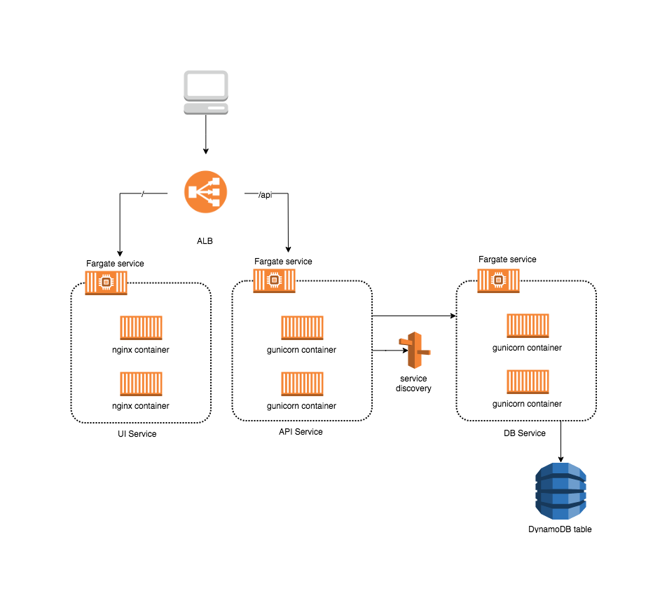

# Como desplegar una aplicación con Fargate

Este repo contiene las aplicaciones de mi charla "Desplegando una aplicación con Fargate" para el AWS User Group México de Septiembre del 2018.

Puedes revisar el post completo en:

https://medium.com/

El frontend es una aplicación de ejemplo de Vue.js que puedes encontrar en:

https://github.com/niteshkumarniranjan/vue-todo

El diagrama de la implementación final de este ejercicio es algo así:

